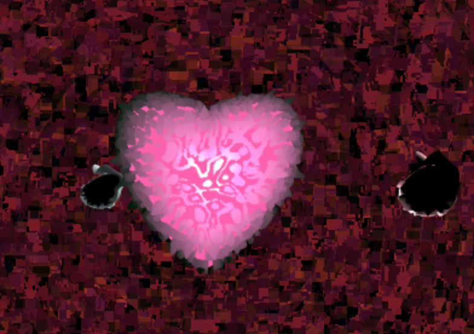

# CIS 566 Project 1: Noisy Planets

  Name: Sangeun Lee
  PennKey: eunsang

- Citation of external resources 
-[Noise functions](https://gist.github.com/patriciogonzalezvivo/670c22f3966e662d2f83)
- [IQ's heart making](https://www.youtube.com/watch?v=aNR4n0i2ZlM)
- [Implicit Procedural Planet Generation](https://static1.squarespace.com/static/58a1bc3c3e00be6bfe6c228c/t/58a4d25146c3c4233fb15cc2/1487196929690/ImplicitProceduralPlanetGeneration-Report.pdf)
- [Curl Noise](https://petewerner.blogspot.com/2015/02/intro-to-curl-noise.html)
- [GPU Gems Chapter on Perlin Noise](http://developer.download.nvidia.com/books/HTML/gpugems/gpugems_ch05.html)
- [Worley Noise Implementations](https://thebookofshaders.com/12/)

- A link to your live github.io demo 
http://sangeun44.github.io/Heart
- Screenshot of the planet

Mountains
  -Worked with Perlin noise to create spikes
  -Modifiable spikes from dat.GUI

Planet 
  -Work with recursive Perlin noise
  -Work with 

Bunnies
  -Shaped with parabolic curves
  -Simplex Noise dresses
  
Sky
  -Perlin Noise recursion

